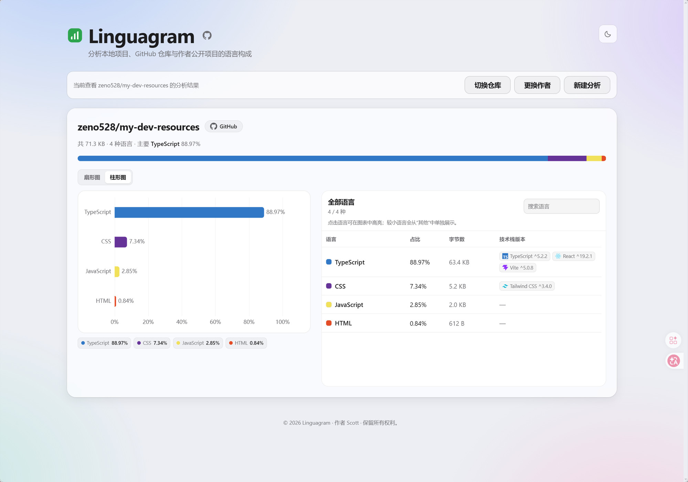

# Linguagram

把本地项目文件夹拖进网页，按 [Linguist](https://github.com/github/linguist) 规则分析编程语言占比——和 GitHub 仓库页右侧那条彩色 bar 用同一套规则。也支持粘贴 GitHub 公开仓库地址直接分析。

<p align="center"></p>

## 技术栈

Go · Gin · [go-enry](https://github.com/go-enry/go-enry)（Linguist 的 Go 移植）· Vue 3 · Vite · TypeScript · ECharts

## 本地开发

需要 Go ≥ 1.25、Node ≥ 20、pnpm。

```bash
# 后端（:8080）
cd backend && go run .

# 前端（:5173，代理 /api 到 :8080）
cd frontend && pnpm install && pnpm dev
```

打开 http://127.0.0.1:5173 ，把项目文件夹拖进去即可。

## 部署

前端 `dist` 由 Go `embed` 打进单二进制，前置反代（Caddy/Nginx）指向 `127.0.0.1:18080`，systemd 管进程。

### 服务器侧准备

1. systemd unit `/etc/systemd/system/lang-analyzer.service`：

   ```ini
   [Unit]
   Description=lang-analyzer
   After=network-online.target

   [Service]
   ExecStart=/usr/local/bin/lang-analyzer
   Environment=LANG_PORT=18080
   DynamicUser=yes
   Restart=on-failure
   RestartSec=3
   NoNewPrivileges=yes

   [Install]
   WantedBy=multi-user.target
   ```

2. 反代（Caddy 示例）：

   ```
   your-domain.com {
       reverse_proxy 127.0.0.1:18080
   }
   ```

`LANG_PORT` 默认 `8080`，被占就换一个，unit 与 workflow 两边保持一致。


## 致谢

语言识别基于 [GitHub Linguist](https://github.com/github-linguist/linguist)（MIT）—— GitHub 仓库页语言占比条背后的项目；通过其 Go 移植 [go-enry](https://github.com/go-enry/go-enry) 调用，共享同一套 `languages.yml` 数据与识别规则。
