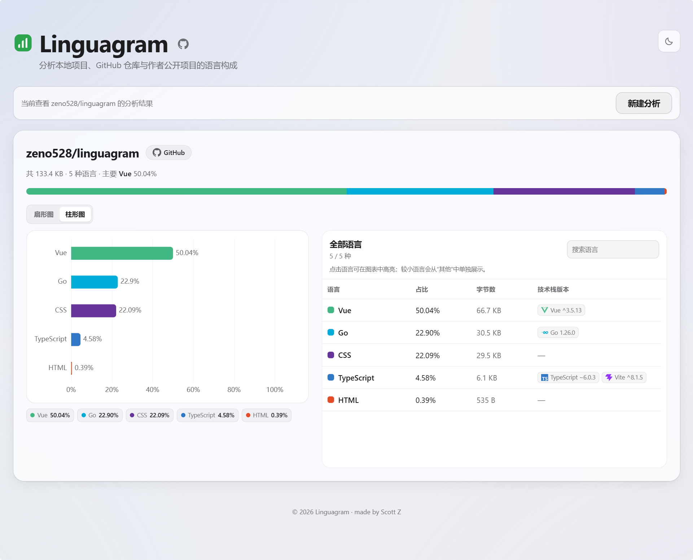
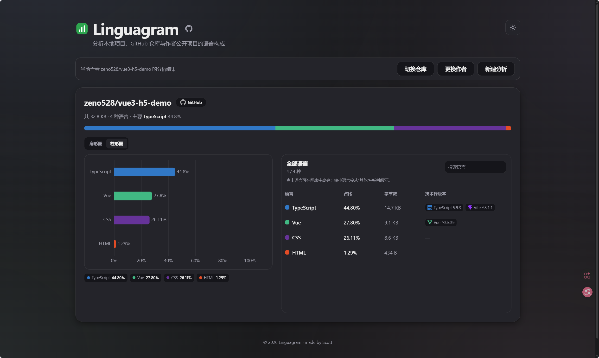

# Linguagram

[](https://github.com/zeno528/linguagram)
[](https://go.dev)
[](https://gin-gonic.com)
[](https://vuejs.org)
[](https://vitejs.dev)
[](https://www.typescriptlang.org)
[](https://echarts.apache.org)

<p align="center"></p>
<p align="center"></p>

## 项目说明

Linguagram 把本地项目文件夹拖进网页（或粘贴 GitHub 公开仓库地址），按 [GitHub Linguist](https://github.com/github-linguist/linguist) 规则分析编程语言占比——和 GitHub 仓库页右侧那条彩色 bar 用同一套规则。语言识别通过 Linguist 的 Go 官方移植 [go-enry](https://github.com/go-enry/go-enry) 完成，结果与 GitHub 完全一致。

前端读文件、后端识别分类，编译成单二进制部署（前端 `dist` 由 Go `embed` 打包）。

## 功能

- 📁 **本地文件夹分析** — 拖入项目文件夹，File System Access API 递归收集
- 🔗 **GitHub 仓库分析** — 粘贴公开仓库地址直接分析
- 👤 **作者主页仓库列表** — 粘贴作者主页，列出其公开仓库选择分析
- 🎨 **饼图 / 柱状图** — 一键切换，语言占比可视化
- 🔍 **语言搜索 + 高亮** — 搜索语言，图表联动高亮
- 🏷️ **技术栈版本识别** — 识别框架及版本（npm / pip / maven 等）
- 🌗 **深色 / 浅色主题** — 一键切换
- ⏹️ **可取消** — 分析过程中随时中止
- ✅ **与 GitHub 一致的扫描规则** — vendor / dotfile / documentation / configuration 目录自动跳过，仅 programming + markup 计入

## 技术栈

| 层 | 选型 |
|---|---|
| 后端 | [Go](https://go.dev) · [Gin](https://gin-gonic.com) · [go-enry](https://github.com/go-enry/go-enry)（Linguist 的 Go 移植）|
| 前端 | [Vue 3](https://vuejs.org) · [Vite](https://vitejs.dev) · [TypeScript](https://www.typescriptlang.org) · [ECharts](https://echarts.apache.org) |

## 本地开发

需要 Go ≥ 1.25、Node ≥ 20、pnpm。

```bash
# 后端（:8080）
cd backend && go run .

# 前端（:5173，代理 /api 到 :8080）
cd frontend && pnpm install && pnpm dev
```

打开 http://127.0.0.1:5173 ，把项目文件夹拖进去即可。

### GitHub API（可选）

公开仓库默认可匿名读取；部署给多人使用时，可仅在**后端进程环境变量**设置 `GITHUB_TOKEN`，提高 GitHub REST API 的限额。使用细粒度令牌时只授予目标公开仓库的 `Contents: Read` 权限；不要把令牌写入前端代码、`.env` 提交记录或浏览器配置。

```ini
# systemd service 示例
Environment=GITHUB_TOKEN=ghp_...
```

## 部署

前端 `dist` 由 Go `embed` 打进单二进制，前置反代（Caddy/Nginx）指向 `127.0.0.1:18080`，systemd 管进程。

### 服务器侧准备

1. systemd unit `/etc/systemd/system/lang-analyzer.service`：

   ```ini
   [Unit]
   Description=lang-analyzer
   After=network-online.target

   [Service]
   ExecStart=/usr/local/bin/lang-analyzer
   Environment=LANG_PORT=18080
   DynamicUser=yes
   Restart=on-failure
   RestartSec=3
   NoNewPrivileges=yes

   [Install]
   WantedBy=multi-user.target
   ```

2. 反代（Caddy 示例）：

   ```
   your-domain.com {
       reverse_proxy 127.0.0.1:18080
   }
   ```

`LANG_PORT` 默认 `8080`，被占就换一个，unit 与 workflow 两边保持一致。

## 致谢

语言识别基于 [GitHub Linguist](https://github.com/github-linguist/linguist)（MIT）—— GitHub 仓库页语言占比条背后的项目；通过其 Go 移植 [go-enry](https://github.com/go-enry/go-enry) 调用，共享同一套 `languages.yml` 数据与识别规则。
